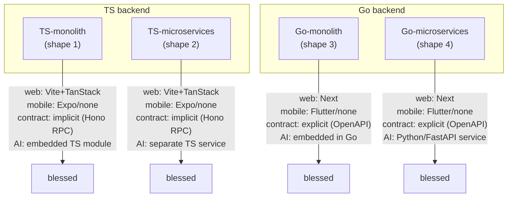

# The blessed 2×2 (decisions 7, 24)

This is the *generator's* map: the four combinations the CI matrix
CI-tests as units, and how each cell maps to the workspaces the CLI
materializes. The scaffolded project's `docs/architecture/` shows the
reader *their* shape; this doc shows the contributor the whole matrix
and the workspace grammar each cell shares.

## The matrix



The axes (decision 24): **backend-language** (TS/Go) × **topology**
(monolith/microservices) — the 2×2 that is CI-tested. Three more axes
compose on top for any combination the user picks: **web variant**
(Next / Vite+TanStack / TanStack-Start-later), **mobile** (Expo/Flutter/
none), **AI** (on/off). "Generatable-anything, CI-blessed-4": every
combination is generatable; only the four cells above carry the CI
guarantee (unit + contract + the one E2E over `items`, decision 22).

## How each cell maps to workspaces

The workspace grammar is shared (decision 9); what changes per cell is
*which* workspaces materialize and how they connect.

### TS shapes (1, 2) — implicit contract

```
apps/web            Vite + TanStack (decision 24b default for TS)
apps/api            Hono api — the modular monolith's internal modules
apps/api-auth       shape 2 only — the example split (sole minter)
apps/mobile         Expo, when mobile on (a peer app sharing packages)
packages/db         Drizzle schema + migrations (decision 14)
packages/auth       the auth shim (decision 12) — shared seam
packages/shared     validation schemas + pure utils (decision 26)
packages/ai         TS AI primitives, when AI on (decision 20)
packages/api-client the typed Hono RPC client (decision 17/18)
```

The contract is **implicit**: shared TS packages, no artifact. The
router's TS type *is* the wire contract, inferred end-to-end by
`api-client` via Hono RPC (`hc<typeof app>()`).

### Go shapes (3, 4) — explicit contract

```
apps/web            Next.js (decision 24b default for Go)
apps/api            Gin + Huma api (decision 19)
apps/api-auth       shape 4 only — the example split (sole minter)
apps/mobile         Flutter, when mobile on (shares only the contract)
packages/contract   openapi.yaml (generated from Go structs, committed)
                    + generated TS/Dart clients + Go/Python stubs
apps/ai             shape 4 + AI on — the Python/FastAPI service
```

The contract is **explicit**: `packages/contract` is the only package —
`openapi.yaml` generated from the Go api's structs via Huma+Gin during
build and committed as the seam (decision 19), with TS/Dart clients
generated downstream. No `packages/db` / `packages/auth` shared across
languages; each backend owns its own.

### The per-cell deltas

| Cell | split-seam | contract mechanism | default web | mobile | AI shape |
|---|---|---|---|---|---|
| 1 (TS-monolith) | present, unsplit | Hono RPC | Vite+TanStack | Expo | embedded TS module |
| 2 (TS-microservices) | example split done | Hono RPC | Vite+TanStack | Expo | separate TS service |
| 3 (Go-monolith) | present, unsplit | OpenAPI (Huma+Gin) | Next | Flutter | embedded in Go |
| 4 (Go-microservices) | example split done | OpenAPI (Huma+Gin) | Next | Flutter | Python/FastAPI service |

**Mobile** is a free delete-the-folder toggle in every cell — `apps/mobile`
(Expo or Flutter) is absent when the user says no mobile. **AI** is
opt-in like mobile (decision 21): if declined, the AI workspace/module/
service is absent, not present-but-unused.

## The stable spine behind the cells

The four cells differ in the *surface* (which workspaces, which
mechanism). The **spine** — the contract, and the seams around it — is
identical: `apps/api` is a modular monolith with internal modules and
explicit interfaces (decision 27); the example split extracts auth into
a sibling service by *capability*, not business domain (decision 10);
exactly one process mints tokens (decision 11); the auth shim owns the
surface, not the crypto (decision 12). The 2×2 is the same spine
composed with four different toolchains.
